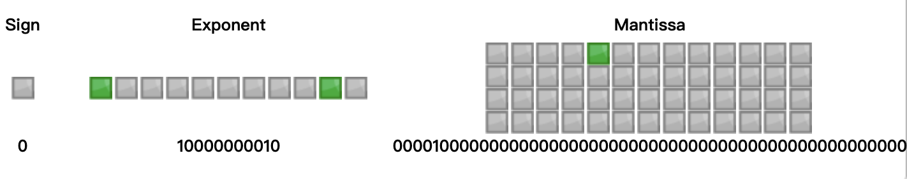
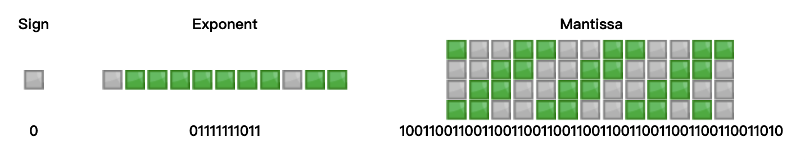
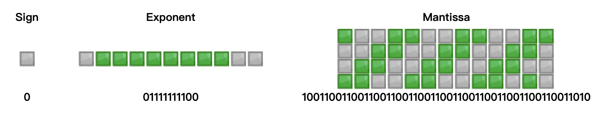

## 为什么要写这篇博客

最近在和同事午饭的时候聊到这个问题。想到了刚接触编程时粗略了解过，但是又没办法讲清楚，所以决定利用这篇博客复习一下。也希望给相关的二进制存储的疑问画上一个句号。

## 先来了解存储数字的标准

计算机是二进制的。浮点数是没有办法用二进制进行精确表示。我们的 CPU 表示浮点数由两个部分组成：**指数** 和 **尾数**，这样的表示方法一般会失去一定的精确度，有些浮点数运算也会产生一定的误差，是实数的无限精度跟计算机的有限内存之间的矛盾，通用语言中的浮点数都是按照 **二进位浮点数算术标准** (IEEE 754)标准存储。

一般语言把数字区分整数型和小数型以不同标准存储，但是 `js` 比较特殊，在 `js` 中，不管是整数还是小数都是以 IEEE 754 标准中的 **双精度浮点法** (Double 64)存储的。整数 `1` 被当成 ` 1.0 ` 存储。

## 那什么是双精度浮点法 ?

先来介绍一下 **双精度浮点法**，比起 [单精度浮点法](https://zh.wikipedia.org/wiki/%E5%96%AE%E7%B2%BE%E5%BA%A6%E6%B5%AE%E9%BB%9E%E6%95%B8)，**双精度浮点法** 使用 `64` 位二进制来储存一个浮点数。它可以表示二进位制的 `53` 位有效数字，其可以表示的数字的范围为

$$
[-(2^{53}),  2^{53} - 1]
$$

结构包含 `64` 位二进制位，分别是**符号位**，**指数位**，**尾数位**。

- sign bit（符号）：用来表示数值正负，`0` 代表数值为正，`1` 代表数值为负。占位 `1` 比特。
- exponent（指数）：用来表示次方数，占位越多，可以表示数字的范围越大。可以理解成它表示 **小数点** 在数字的什么位置上，这也是小数在计算机中被叫做浮点数的原因。占位 `11` 比特。
- mantissa（尾数）：用来表示精确度，可以理解成占位越多，那么保存小数点后更多的位数。占位 `52` 比特。


## 二进制转换

那么把一个数字存入到内存中是如何实现的呢？首先先把数字转换计算机可识别二进制格式再通过 **双精度浮点法** 存储，这里区分两种情况：整数和小数(整数部分和小数部分)

- 整数：整数除以 `2`，记录结果和余数。然后用上次结果继续除以 `2`，再次记录商和余数。重复这个步骤，直到商为 `0` 为止。那么所得余数从后往前排列就是这个整数的二进制。

- 小数：小数位乘以 `2`，记录结果，区分整数位和小数位，然后继续用小数位乘以 ` 2`，再次记录结果。重复这个步骤，直到小数位为 `0` 为止，那么其中得到的整数结果从前往后排列就是小数的二进制。

#### 整数 8 转换二进制过程

```javascript
8 / 2 = 4 // 余数 0
4 / 2 = 2 // 余数 0
2 / 2 = 1 // 余数 0
1 / 2 = 0 // 余数 1
```

然后把倒过来把余数排列，`1000` 就是 8 的二进制结果。

#### 小数 0.25 转换二进制过程

```javascript
0.25 * 2 = 0.5 // 整数位：0 小数位：0.5
0.5 * 2 = 1    // 整数位：1 小数位：0
```

整数位结果从前往后取出得到 `01` 就是 0.25 的二进制结果。

#### 8.25 的二进制过程

实际拆解成整数位 `8` 和小数 `0.25`，分别按照对应的方法去转换，`8` 的二进制就是 ` 1000`，`0.25` 的二进制是 `01`，加个小数点合并到一起就是 `1000.01`，所以 `8.25` 的二进制为 `1000.01`。

## 以双精度浮点法存储到内存

按照上述步骤，`8.25` 转换二进制得到 `1000.01`，那么 `1000.01` 是如何以双精度浮点法存储的呢，第一步先用二进制科学记数法表示，得到 `1.00001` \* `2^3`，然后我们把它拆分下，分别存入符号位，指数位，尾数位。

- 符号位存入 ` 0`，因为 ` 1000.01` 是正数
- 指数位存入 1026 的二进制 ` 10000000010`，指数应该是 `3`，为什么存入 ` 1026` ? 参考下面标题为 *为什么指数位要设置偏移量 ?*
-  尾数位存入 ` 00001`，把 `1.0001` 小数点前的 `1` 省略，因为转换为二进制位后，只可能是 0 和 1，再进行二进制科学记数法，第一位一定大于 0，所以又排除了 0，所以小数点前的数只能是 1，就可以省略掉

至此使用双精度浮点法 `8.25` 存储的结果为：


## 为什么指数位要设置偏移量 ?

这里需要解释下，按照上面的例子，指数应该是 `3`，为什么存入 ` 1026` ?

是因为指数位有 `11` 位，可以表示 ` 0 ~ 2^11`，也就是 ` 0 ~ 2048`， 因为指数可能 **正** 或 **负** 的，这种情况下计算机不仅仅要识别指数有多大，还需要识别是正是否，无疑增加了复杂度。

为了简化这个问题，指数位只存储无符号整数，所以使用了偏移量的概念，因为指数有正负， `0 ~ 2048` 没办法表示负数，就把 `0 ~ 2048` 从中一刀切开，范围变成 `-1024` 到 `+1024`， 对了，其中还包括 `0` ，就是 `-1024` 到 `+1023` 。存储的时候让原本的指数不管正负都加上`1024 `的偏移量，可以保证，存储的都是整数，当二进制转回十进制的时候，再减去 1024 就可以了，那 1024 + 3 应该是 1027 啊，为什么实际用了 1026 呢，因为人们为了特殊用处，不允许使用 ` 0 ` 和  `1023` 这两个数字表示指数，因为这两个极值，来表示一些特别的含义，比如NaN，Infinity，0等。这样的话少了 2 个数字，偏移量的设置自然就只好采用最大值 ` 1023 ` 了。因为`-1023 + 1023 = 0`，最小的指数为`0`，所以指数位 ` 3 + 1023`  为 ` 1026` 。

## 从内存中如何取出使用呢？

按照 **双精度浮点法** 存入内存的数字如何拿出来使用呢？先看转换公式：
$$
(-1)^{sign} \times 2^{exponent}  \times  (1 + mantissa)
$$

还是用 ` 8.25` 举例，符号位为 `0`，指数位为 1026 - 1023 (偏移量) = 3，尾数为 `00001`，可得：
$$
(-1)^{0} \times 2^{3}  \times  (1 + 0.00001) = 1   \times  1000.01
$$
把二进制结果 `1000.01` 转换为十进制，先把小数位按照**第 1 位的值\*2^(-1)**，**第 2 位的值\*2^(-2)**，**第3位的值\*2^(-3)**  …到最后一项 **第n位的值\*2^(-n)**，然后把最后结果相加，因为 `1000.01` 只有两位小数位 `.01`，按照下面方法计算可得 `0.25`：
$$
0 \times 2^{-1} + 1 \times 2^{-2}   = 0.25
$$

整数位 1000 转十进制，和小数位计算方式一样，只是指数从负数换成整数就好了，最终结果是 `8`，把 **小数位** 和 **整数位 **结果加到一起就是最终结果了 `8.25` 了

$$
0 \times 2^{1} + 0 \times 2^{2} + 0 \times 2^{3} + 1 \times 2^{4}  = 8
$$

## 总结

`js` 中数字存入内存的步骤：

- 分别把整数位、小数位**转二进制**
- 使用二进制科学计数法表示
- 按照双精度浮点法存入**符号位**、**指数位**、**尾数位**

数字从内存中步骤：

- 按照公式，替换**符号**、**指数**、**尾数**
- 得到的结果转十进制

## 扩展为什么 0.1 + 0.2 !== 0.3

从上文我们知道了一个数是如何存储的，那我们按照上面的方式模拟一下 0.1 + 0.2 的过程：

0.1转换为二进制为 0.0001100110011(0011循环)，因为尾数只能存储52位，没办法，就把52位以后截取掉了，实际存入结果为：



0.2同理，也是循环二进制，存储结果为：




按照上面的方法分别转回十进制可得：

**0.1 为 0.100000001490116119384765625**

**0.2 为 0.20000000298023223876953125**

相加结果为 `0.30000000447034836`，原因就是在二进制中都只能精准表示 2 除尽的数字 1/2, 1/4, 1/8，当无法精准表示时，会舍弃存储。就好比，十进制的世界中，1/3，是 0.33333... 是无限循环的，如果人的理解也像计算机一样，是按照固定长度去表示的话，那是无法精准表示的一样。