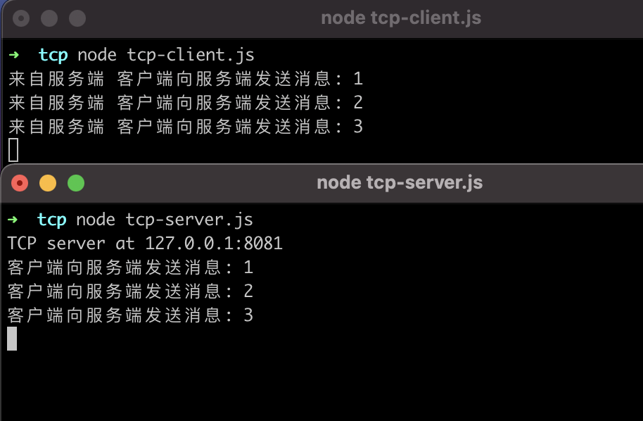
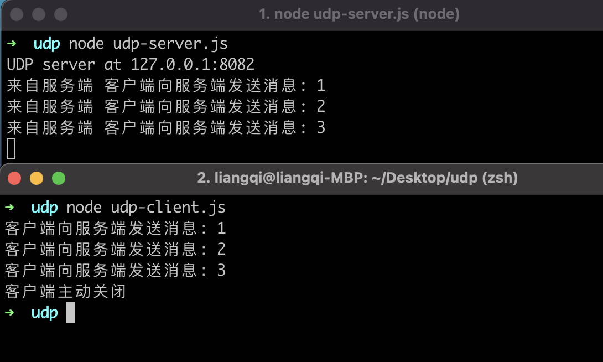

## 为什么要写这篇博客

一个是感觉自己的计算机网络基础薄弱，关于七层模型和tcp、udp看过几次了，都不够透彻，知其然不知其所以然。再一个，最近和同事有聊到这个事，感觉自己也说不明白，又意识到很重要，所以决定整理一下，自己感觉自己会了和可以给别人讲明白这个事儿，区别还是很大的啊。就参考资料和自己理解记录一下。

## 先说什么是网络协议

两台设备进行网络通信时，双方要提前`约定一些规则`。这样才可以让对方设备理解你要做什么。比如，如何发起通信，如何发出/接收数据，如何关闭链接。

## 再说 OSI 7层模型 和 TCP/IP 4层模型

`OSI`(Open System Interconnection) 开放式系统互联参考模型，为了统一处理，模块化，易于维护，OSI采用**分层结构**。包含七层，每一层实现各自的功能和协议，通过接口提供给更高一层并完成与相邻层的接口通信。

IOS 7层模型是一种网络通信理论模型。其含义就是推荐所有公司使用这个规范来控制网络。这样所有公司都有相同的规范，设备就能互联了。OSI参考模型是**学术上**和**法律上**的国际标准，是完整的**权威的网络参考模型**。

关系如下：

| OSI 7层模型          | OSI 层功能                                                   | 对应 TCP/IP 4层模型 | 对应网络协议                            |
| -------------------- | ------------------------------------------------------------ | ------------------- | --------------------------------------- |
| 应用层 Application   | 为应用进程提供网络服务。                                     | 应用层              | HTTP、FTP、SMTP                         |
| 表示层 Presentation  | 数据格式化，加密和解密。                                     | 应用层              | Telnet、Rlogin、SNMP、Gopher            |
| 会话层 Session       | 建立应用和应用之间的连接。                                   | 应用层              | SMTP、DNS                               |
| 传输层 Transport     | 建立设备和设备之间的连接。                                   | 传输层              | TCP、UDP                                |
| 网络层 Network       | 为数据包选择路由，寻址。                                     | 网络层              | IP、ICMP、ARP、RARP、AKP、UUCP          |
| 数据链路层 Data Link | 根据以太网协议将一组电信号组成一个数据包，称作”帧”，控制传输。通俗说，就是控制数据在网线、光纤传输。 | 数据链路层          | FDDI、Ethernet、Arpanet、PDN、SLIP、PPP |
| 物理层 Physical      | 把网线，光纤将设备链接起来组网。物理传输介质。               | 数据链路层          | IEEE 802.1A、IEEE 802.2到IEEE 802.11    |

## TCP/IP 4层模型 (协议簇)

`TCP/IP` 协议簇是internet的基础，是多个协议的统称，命名为TCP/IP是因为`TCP`和`IP`是其中很重要的两个协议。

`TCP/IP` 分为四层，每一个层都有各自的协议和功能，其中 `TCP` 和 `UDP` 协议位于TCP/IP协议簇的传输层。

`TCP/IP` **借鉴**了OSI的分层概念建立`TCP/IP`模型，`TCP/IP` 已被广泛使用，**成为网络互联事实上的标准**。

## TCP

TCP(**Transmission Control Protocol**
)全称是传输控制协议，是一种**面向连接的**、**可靠的**、**全双工**、**单播传输的**、**基于字节流的**传输层通信协议。

- 面向连接： 即传递数据前在两端建立连接，使用“**三次握手**”确保两端的发送和接收能力，**提供可靠的连接**。
- 仅支持单播传输：只能进行**一对一**的数据传输，不支持组播和广播传输方式。
- 拥堵控制：网络拥堵的时，`TCP`能够减小向网络注入数据的速率和数量，缓解拥堵，提供对流量控制和服务质量的访问。
- 全双工： 双端既可以当**接收者**，也可以当**发送者**。
- 基于字节流模式： 比如发送端发送100字节到目标端，目标端可以分10次，每次10字节接受，也就是以**少量数据分以任意次接收**。

## UDP

UDP(User Data Protocol)全称用户数据报协议，是一种**无连接的**、**不可靠的**、**支持组播和广播**、**基于数据报**的传输层通信协议。

- 无连接不可靠： **不需要繁琐的三次握手**，确认、重传、拥塞控制等机制，没有这些安全机制，速度更快的同时，安全性变差，**易丢包**。UDP使用**尽可能最大努力交付**，但不保证可靠交付。
- 支持组播和广播： 可以**一对一**，**一对多**，**多对一**、**多对多**数据传输。
- 基于数据报模式： 一次发送对应一次接收，**一次只读取一个报文**，多个报文不可以合并。

## UDP和TCP区别总结

| 指标     | TCP        | UDP                            |
| -------- | ---------- | ------------------------------ |
| 连接     | 面向连接   | 无连接                         |
| 报文     | 面向字节流 | 面向报文                       |
| 效率     | 低         | 高                             |
| 是否可靠 | 可靠       | 不可靠                         |
| 拥塞控制 | 有         | 无                             |
| 速度     | 慢         | 快                             |
| 双共性   | 全双工     | 一对一、一对多、多对一、多对多 |

## 使用 nodejs 实现 TCP 连接

服务端

```jsx
const net = require('net')
const HOST = '127.0.0.1'
const PORT = 8081
const server = net.createServer()
server.on('listening', () => {
    console.log(`TCP server at ${HOST}:${PORT}`)
});
server.on('connection', socket => {
    socket.on('data', buffer => {
        const msg = buffer.toString()
        console.log(msg)
        socket.write(Buffer.from(`来自服务端 ${msg}`))
    });
})
server.on('close', () => {
    console.log('TCP server close!')
});
server.on('error', err => {
    console.error(`TCP server error :${err}`, )
    setTimeout(() => {
        server.close()
    }, 1000);
});
server.listen(PORT, HOST)
```

客户端

```jsx
const net = require('net')
const HOST = '127.0.0.1'
const PORT = 8081
const client = net.createConnection({
    host: HOST,
    port: PORT
});
client.on('connect', () => {
    setTimeout(() => {
        client.write('客户端向服务端发送消息: 1')
    }, 1000)
    setTimeout(() => {
        client.write('客户端向服务端发送消息: 2')
    }, 2000)
    setTimeout(() => {
        client.write('客户端向服务端发送消息: 3')
    }, 3000)
})
client.on('data', buffer => {
    console.log(buffer.toString())
});
client.on('error', err => {
    console.error('TCP server error', err)
});
client.on('close', err => {
    console.log('client disconnects', err)
});
```



## 使用 nodejs 实现 UDP 连接

服务端

```js
const dgram = require('dgram')
const HOST = '127.0.0.1'
const PORT = 8082

const server = dgram.createSocket('udp4')

server.on('listening', function () {
    const address = server.address()
    console.log(`UDP server at ${HOST}:${PORT}`)
});

server.on('message', function (message, remote) {
    console.log(`来自服务端 ${message}`)
})

server.bind(PORT, HOST)
```

客户端

```js
const dgram = require(`dgram`)
const PORT = 8082
const HOST = '127.0.0.1'

const client = dgram.createSocket('udp4')

setTimeout(() => {
	sendMsg(Buffer.from(`客户端向服务端发送消息: 1`))
}, 1000)

setTimeout(() => {
	sendMsg(Buffer.from(`客户端向服务端发送消息: 2`))
}, 2000)

setTimeout(() => {
	sendMsg(Buffer.from(`客户端向服务端发送消息: 3`))
}, 3000)

setTimeout(() => {
	client.close()
	console.log('客户端主动关闭')
}, 4000)

function sendMsg(_msg) {
	client.send(_msg, PORT, HOST, function(err, bytes) {
		if (err) throw err
		console.log(_msg.toString())
	});
}
```



