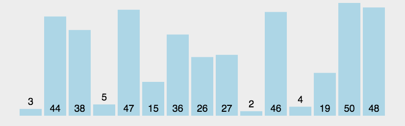
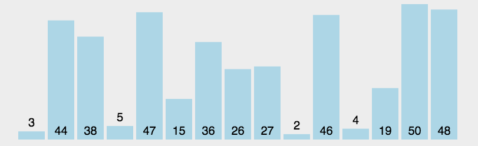
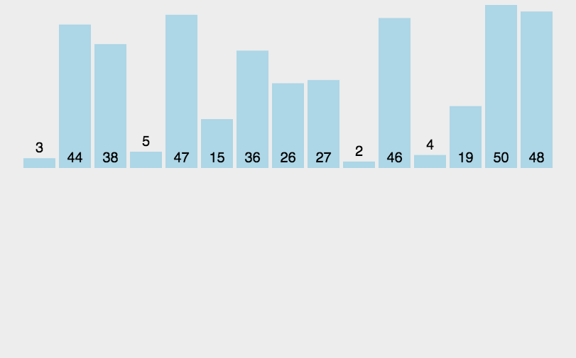
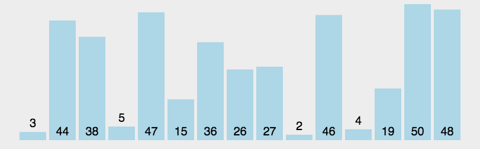

## 冒泡排序（Bubble sort）

#### 原理和演示：

- 依次比较数组中相邻的每一对值，如果前面的值 **大于** 后面的值，则交换他们俩的位置。如果数组中`5`个数字(length 为 5)，由于比较 **两个一组** 的数字，那么只需要`4次`(length - 1)比较，就可以实现把数组中最大的一个数放到最后。

```javascript
function bubbleSort(arr) {
  for (let i = 0; i < arr.length - 1; i++) {
    if (arr[i] > arr[i + 1]) {
      let temp = arr[i];
      arr[i] = arr[i + 1];
      arr[i + 1] = temp;
    }
    console.log(`执行${i + 1}次`);
  }
  return arr;
}
```

- 通过第一步得到最大的一个数放在数组最后。那么剩下的前三个数继续执行第一步，结果找到第二大的数，放在数组倒数第二位，重复此步骤，直到比对完数组中最后一组数。由于第一步骤每次得到一个最大值放最后，`j`对应的正好是数组最后有多少个最大值，可以免去比较。所以上步骤每次循环可以优化一下每次少算一个最大值，每次循环总数`- 1`也就是下面例子中的`- j`。

  ```javascript
  function bubbleSort(arr) {
    for (let i = 0; i < arr.length - 1; i++) {
      for (let j = 0; j < arr.length - 1 - i; j++) {
        if (arr[j] > arr[j + 1]) {
          let temp = arr[j];
          arr[j] = arr[j + 1];
          arr[j + 1] = temp;
        }
        console.log(`执行${i + 1}次`);
      }
    }
    return arr;
  }
  ```

- 两个变量互换值可以使用`es6`的解构语法，省去使用`temp`缓存，语法为`[a, b] = [b, a]`，即可交换`变量a`和`变量b`的值。复杂数据类型`Object`和`Array`都适用；如果第二个循环中的大小判断，一次都没有执行，说明当前这组数据是正序无需排序，用一个变量`isOk`标记下配合`break`，实现方法优化。

#### 完整代码：

```javascript
function bubbleSort(arr) {
  console.time('耗时');
  for (let i = 0, len = arr.length; i < len - 1; i++) { // 要比对的次数，- 1是因为6个数俩俩比较只需要比对5次
    let isOk = true; 
    for (let j = 0; j < arr.length - 1 - i; j++) { // 当前和下一项的每次比较。完整进行一次比较后，最大的值就会在最后一位，- i意味着最大这个值不再需要比对了
      if (arr[j] > arr[j+1]) {
        [arr[j], arr[j+1]] = [arr[j+1], arr[j]]; // 当前值小于下一项，交换位置
        isOk = false; // 如果第一次比较时，没有发现一个有效条件，那么说明整个数组默认就是排好序的
      }
    }
    if (isOk) {
      break;
    }
  }
  console.timeEnd('耗时');
  return arr;
}
```

#### 冒泡排序动画演示：



## 选择排序（Selection Sort）

#### 原理：

- 循环整个数组，找到**最小**的值，放在数组**第一位**(和第一位交换位置）。
- 从数组**第二位**开始重新循环，依旧找到**最小**的值，放在数组第二位，重复此步骤，直到对比完最后一组数据。

#### 完整代码：

```javascript
function selectionSort(arr) {
  for (let i = 0; i < arr.length - 1; i++) {
    // arr.length - 1是因为假定数组中n个数，比较需要两个数，所以只需要比较n-1次
    let minIndex = i; // 记录每次循环开始位置，等待和最小值交换位置
    for (let j = i + 1; j < arr.length; j++) {
      // j+1 是避免比较自身，j永远是i的后一项，让他们俩做比较
      if (arr[j] < arr[minIndex]) {
        // 如果后面的值小于前面的值，需要调换他们俩位置
        minIndex = j; // 保存最小值的下标
      }
    }
    [arr[i], arr[minIndex]] = [arr[minIndex], arr[i]]; // 使用es6的结构语法交换值，把最小值放到数组最前面
  }
  return arr;
}
```

#### 选择排序动画演示：



## 插入排序（Insertion Sort）

#### 原理：

- 将数组分成**两部分**，一部分为**已排序**(默认为数组第一个元素且只有这一个元素)，另一部分为**未排序**。
- 依次从未排序数组中取值，和已排序中的值**依次做对**比，如果**未排序元素**比**已排序元素**中某个元素**小**，那就将**已排序元素**向**后移**一位，使他本来位置变成一个**空位**，再将**待排序数据**插入空位。

#### 完整代码：

```javascript
function insertionSort(arr) {
  let len = arr.length;
  for (let i = 1; i < len; i++) {
    // 循环未排序部分, i=1而不是0是因为默认0项为已排序部分
    let cur = i; // 每次插入后，arr[i]会发生改变，先存下来
    let j = i - 1;
    while (j >= 0) {
      // 循环已排序部分，默认数组第一项有且只有第一项，下标范围为(0 - (未排序元素下标-1))，也就是例子中的i-1
      if (arr[cur] < arr[j]) {
        // 如果未排序元素比已排序元素小，
        [arr[cur], arr[j]] = [arr[j], arr[cur]]; // 交换
        cur = j; // 交换后i值变了，那把交换后的i找回来就可以了
      }
      j--;
    }
  }
  return arr;
}
```

#### 插入排序动画演示：



## 快速排序（Quick Sort）

#### 原理：

- 选择数组中的一个元素作为**基准值**，用两个新数组**分别存储**原数组比基准值**大**的值，和**小**的值。
- 继续**递归处理**这两个新数组，最终用 concat 合并到一起，效果为：比基准值小的数组+基准值+比基准值小的数组。

> 快速排序有其它种实现方法，这是一种简单的实现，非原地排序，由于新建了多个新的数组，会增加空间复杂度，好处再于非常容易理解，可读性强，适合面试手写代码。

#### 完整代码：

```javascript
function quickSort(arr) {
  if (arr.length <= 1) {
    return arr;
  } // 递归边界条件
  let pointIdx = Math.floor(arr.length / 2); // 在数组中间位置取一个基准点
  let point = arr.splice(pointIdx, 1)[0]; // 通过基准点找到这个值，使用splice原因是：要获取这个基准值的同时要把这个基准值从排序数组里删除掉
  let left = [];
  let right = [];
  for (let i = 0, len = arr.length; i < len; i++) {
    if (arr[i] < point) {
      // 循环数组，小于point的放在left中，大的放在right中
      left.push(arr[i]);
    } else {
      right.push(arr[i]);
    }
  }
  // 递归，让每一个left和right继续排序，直到left或right只有一项为止
  return quickSort(left).concat(point, quickSort(right));
}
```

#### 快速排序动画演示：



<hr>

另外说一下，js 的原生提供的 `sort` 排序方法原理：如果数组长度`小于10`，使用插入排序，否则使用快速排序。如其名，快速排序的性能还是很好的。

<hr>

动画来源：[菜鸟教程](https://www.runoob.com/w3cnote/merge-sort.html)  
查看例子：[GitHub](https://github.com/slc3a2/docs/tree/main/javascript_sort)
