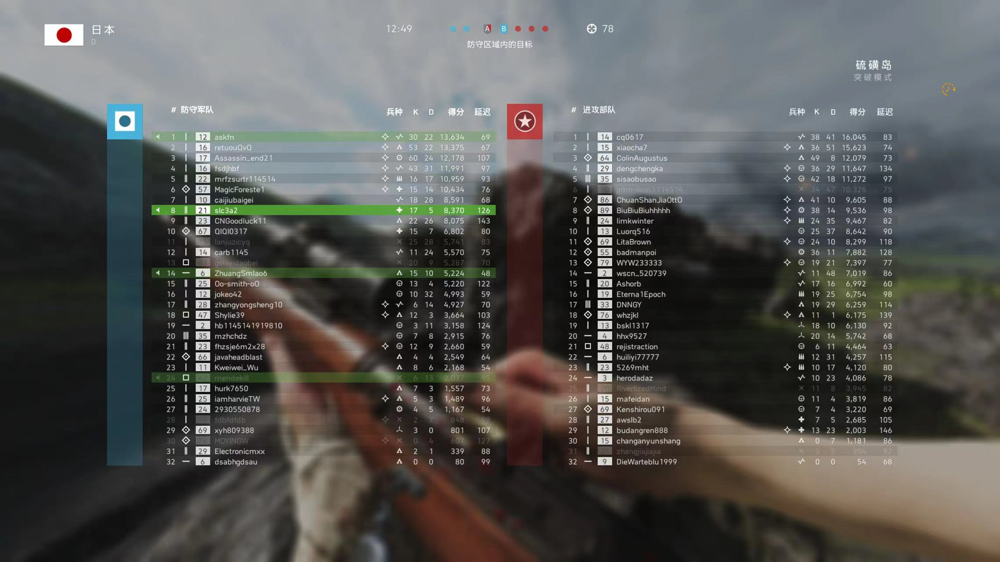
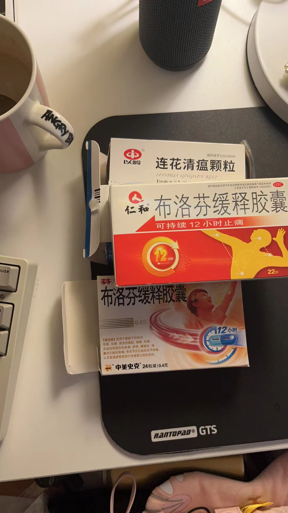
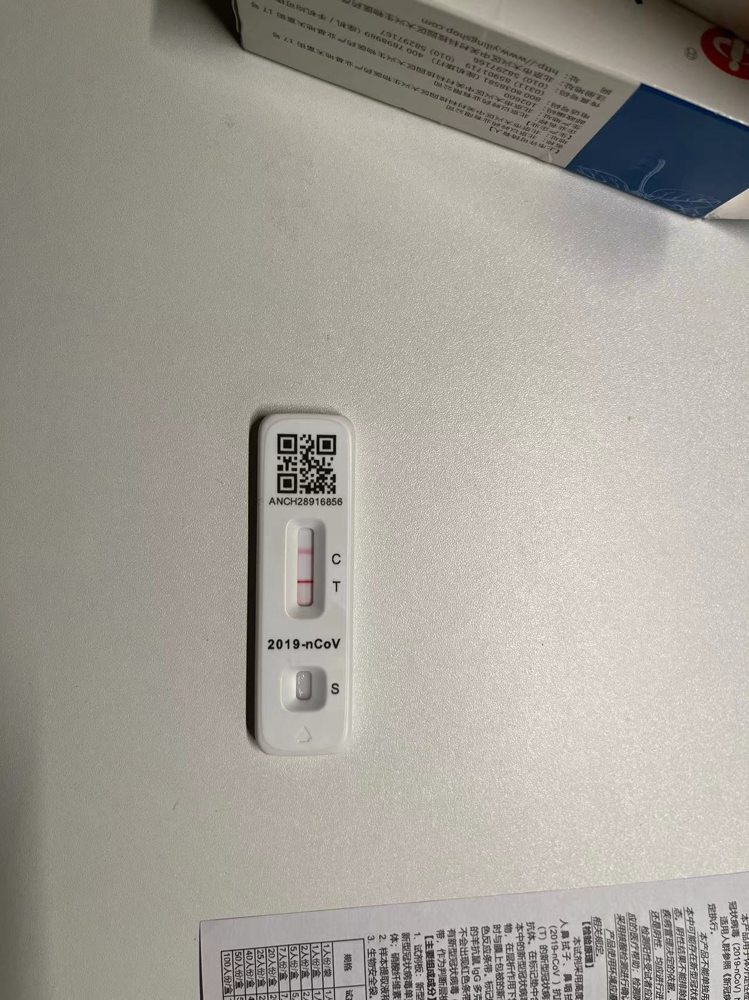
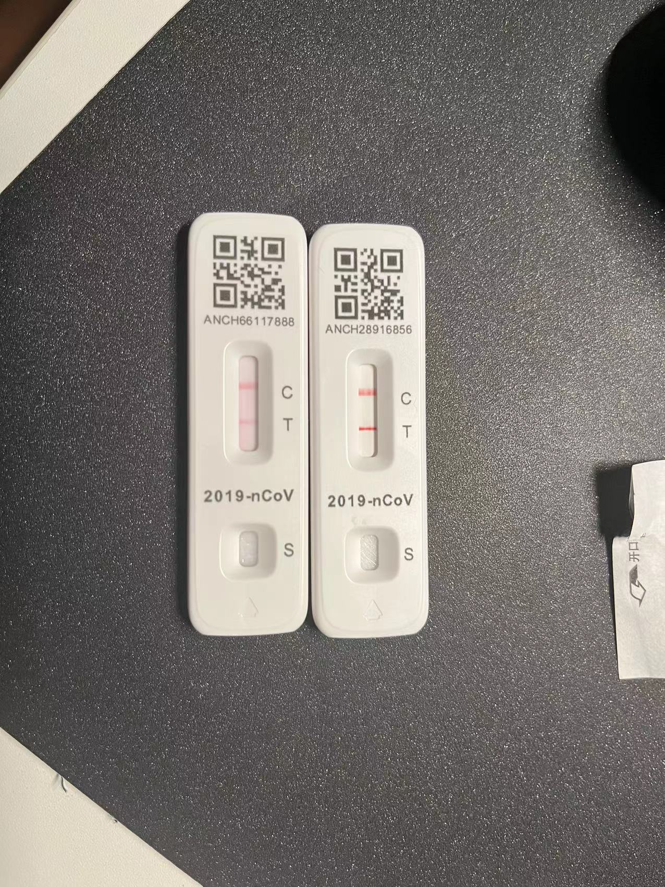

上周六，也就是*12月10月*。晚上10点多开始一直在玩战地5，手感不错，一把阿拉斯英军，对面载具玩的不错步兵跟着坦克推进。我选的突击兵猫在A点前面草里面蹲对面坦克，一次都没打到，最后输了。一把硫磺岛选日军防守拿大狙当老6，守到了山洞，最后赢了。两把玩的挺开心，关机之后洗个漱准备躺下看会b站睡觉。洗漱的时候就开始干咳，无痰，也不剧烈，没当回事。

第二天周日，睡醒了感觉浑身无力，开始发烧，干咳症状消失，没有吃什么奇怪的东西，也没有着凉，一切都很正常，突然状况这么严重，感觉不是普通感冒发烧。周六白天的时候室友在群里说有点发烧怀疑自己是新冠。所以我感觉我应该被传染了。

那时候心里有些慌，因为这之前还没听说身边某个人得了新冠，开始猛喝白开水，开始准备一些相关的物品，把之前买的 布洛芬 和 莲花清瘟 也都找出来了。体温计被我上次打坏了，美团上看了看都没有现货。还有抗原，想确定下自己是不是真是新冠。女朋友在公司和小组内的同事每人团购了`10`个，预计周三才到货，估计到不了，快递都停了，在闲鱼逛了一圈，最后联系附近的一个哥们买了一盒，`190`买了`25`个抗原，算上闪送费溢价`40`，相当于`230`买了`25`个抗原，不得不说，真tm的贵啊。。买完那时候都下午了，发烧的厉害，浑身不得劲啊，吃了片布洛芬迷迷糊糊就睡着了。之后抗原到了女朋友给收的。

周一早上起来依旧发烧，没有体温计，具体不知道多少度，预计有38 9度吧，从没发烧过这么高的温度，当时想法真怕自己烧坏了脑子，没法继续写代码了😂。。。啥都干不了，还是得躺床上，眼睛也不想睁开。和领导请了假，之后测了下抗原阳，石头落地了。还好不是其他的问题，去不了医院。是新冠就好办多了。。周一基本发烧了一天，难受一天。喝了很多很多的水，早晚分别吃了一片布洛芬。下午就睡着了，印象里半夜，我估计也就晚上8 9点钟吧，身上出了很多很多的汗，睡衣睡裤都透了的那种😏，估计是吃了布洛芬的原因，身体通过出汗强制降温。

第三天也就是周二，早上 4 点就醒了，舒服很多了，高烧转低烧了，不想起来，继续请假，在床上醒了睡，睡了醒，到晚上 7 点多又开始高烧了，又一次出了很多汗，吃了一片布洛芬睡觉了，这天女朋友也阳了，不过她只是咳嗽和鼻塞，没发烧过。真是羡慕啊😬。

第四天周三早上 6 点多就醒了，不烧了，可以正常做一些事情了，有一些鼻塞和咳嗽，味觉消失了，感觉只要不高烧就好受很多，开始恢复居家办公。和昨天一样，到晚上又开始发烧，不过温度不高，也没在吃药了。

第五天周四，第六天周五，没再发烧了，开始流黄鼻涕和咳痰。

这几天我的症状先是干咳，然后连续高烧，断断续续高烧，然后低烧，然后流黄鼻涕和咳痰。期间只是在高烧的时候吃了点布洛芬，多喝水，其他药也没吃。能别生病是最好得了，尤其高烧是真的难受啊，另外觉得身体的调整能力真的很强大，在你生病的时候你的整个身体每一个小细胞都在为解决这个病毒工作着，觉得很欣慰。特别感谢最近悉心照顾我的女友！时刻检测我的温度，烧水喂我吃药。虽然她也阳了，但是很羡慕很开心她没有高烧，算是轻微的症状吧。有过这次的经历，保持健康的生活习惯，强身健体，更加爱护自己的身体！！身体是万物之根本啊！💪💪

