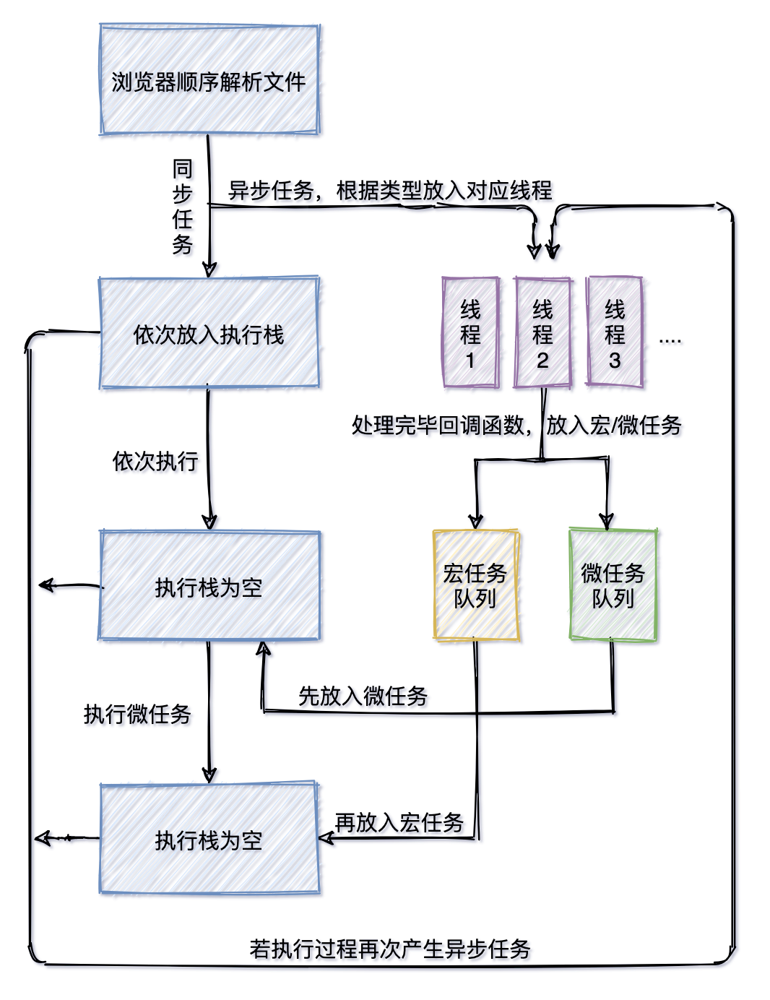

## 为什么要总结这个问题

这几天和我的同事聊到这个问题，他提出了一些深入的问题，想了想，我也有相同的疑问。真是验证了那句话，了解的越多就发现自己了解的越少！so 被迫研究了下这个问题总结起来。便于以后查看和补充。

## 单线程和事件循环

因为多线程会产生共享资源，修改彼此，等复杂问题。并且早期 `js` 只是来显示简单页面的，但今非昔比，或许 `js` 作者可能都没想到现在的 `js` 发展的如此迅猛！所以单线程更适合 `js` ，一直延续至今。那问题来了，只有单线程是如何处理耗时任务且实现不阻塞的呢，这里就用到了事件循环。**事件循环(event loop)**是一种计算机系统运行机制。作为单线程的 `js` 来说，事件循环是来**解决当执行耗时任务时不阻塞主线程的调度机制**。[来自维基百科的解释](https://zh.wikipedia.org/zh-tw/%E4%BA%8B%E4%BB%B6%E7%8E%AF)

## 事件循环工作流程

> 以当前最新版 chrome_v98.0 浏览器为准

`js` 中的任务可分为

- **同步任务**
- **异步任务**

打开一个 tab 页面，浏览器会新开辟一个进程。包含执行栈( `js` 主执行线程)和一些其他线程(属于浏览器)。当一个包含 css， `js` 的 html 页面被加载时，会从上往下，从左到右**按顺序**解析。当遇到同步任务时，它的执行上下文会被放入执行栈，执行完毕后，出栈。下一个放入，依次执行。

当遇到耗时(异步)任务，会根据不同的任务类型，提供给专门的线程来处理，举出一些例子，不限于这些：

- setInterval / setTimeout... ⇒ **timer 线程**
- 网络请求 ⇒ **网络请求线程**
- dom 绘制渲染 ⇒**gui 线程**
- dom 元素的事件监听 ⇒ **事件线程**

等到这些异步任务应该被执行时，比如用户**点击按钮**、**网络请求**、**延时器时间**到了等，会把相应的回调函数**放入异步队列**中，按先后顺序排列起来待命。

直到执行栈的所有同步任务执行完毕后，同步栈会从异步队列中第一位开始取出入栈，依次执行。如果每个异步队列中的任务被执行的过程中，再次产生异步任务，会被放到任务队列的最后，等待执行。

## 有一些问题

这些专门线程处理一些任务时候，拿到结果后，都按照先后顺序放入队列被执行，没有办法**控制任务优先级**，希望一些任务不在队列最末尾排队，而是直接插队执行。为了解决这个问题，在异步任务队列中再细分成两种类型，**微任务**和**宏任务**，微任务可以理解是插队的任务，优先级更高。根据类型的不同会被放入不同的队列：

- 微任务队列 : **promise**、 **queueMicroTask**、 **mutationObserver**
- 宏任务队列 : **setTimeout**、 **setInterval**、 **requestAnimationFrame**等

按照先微再宏的顺序执行：每一个宏任务开始前，都先要把上一个宏任务产生的微任务执行完毕再开始新的宏任务，微任务是宏任务的一部分，换句话来说，就是当**执行栈空了**之后，**先检查微任务队列**，**再检查宏任务队列**。

## 总结

[B 站](https://www.bilibili.com/video/BV1K4411D7Jb) 有个老外做了个更通熟易懂事件循环动画



## 存在的疑问

- 在分配宏/微任务时有总的调度系统分配？还是一句代码执行过程中有一次机会，让每个线程依次检查一下，把自己任务拿走
- 每个宏任务都有属于自己的微任务队列，还是一共只有一条微任务队列？
  - 回答：node 端的执行规律是一个宏任务队列搭配一个微任务队列，而浏览器是一个单独的宏任务搭配一个微任务队列。但是在 node11 之后，node 和浏览器的规律趋同。
- 如何区分微任务和宏任务的呢，具体是通过哪些特征分类的？

## **最后整一道经典面试题**

> 基于 chrome_v98.0 浏览器环境

```javascript
async function async1() {
  console.log("async1 start");
  await async2();
  console.log("async1 end");
}
async function async2() {
  console.log("async2");
}
console.log("script start");
setTimeout(function () {
  console.log("setTimeout");
}, 0);
async1();
new Promise(function (resolve) {
  console.log("promise1");
  resolve();
}).then(function () {
  console.log("promise2");
});
console.log("script end");
```

解析：按照从上往下顺序先执行同步代码，前两个函数**async**和**async2**是函数声明，忽略。然后第 1 个输出的是**script start**，然后看到**setTimeout**, 由于它是异步且属于宏任务，放到最后执行。然后看到 async1 函数被执行了，进入**async1**函数体。

第 2 个输出的是**async1 start**, 看到 await 规则是：await 右的语句被同步执行，所以第 3 个输出的是**async2**，await 下的语句(函数体内)被当作 async 函数返回一个 promsise 的回调函数体的语句去处理，且被放入了异步任务队列中，等待中。

然后跳出 async1 函数体，继续执行同步代码，遇到 new Promise，第 4 次输出**promise**，看到 resolve，就把 then 中回调，放入任务队列中，然后继续向下执行同步代码，第 5 次输出的最后的**script end**。

至此同步执行栈空了，开始把任务队列中的上下文拿到执行栈执行，由于队列先进先出，所以第一个被入栈的是 async1 的回调，也就是第 6 次输出的是**async1 end**，然后把第二个队列中的上下文放入执行栈，也就是 promise 的 resolve，所以第 7 次输出**promise2**，至此微任务执行完成，现在执行宏任务，也就是 timeout，所以第 8 次输出为**setTimeout**。

最终结果

```javascipt
script start
async1 start
async2
promise1
script end
async1 end
promise2
setTimeout
```
