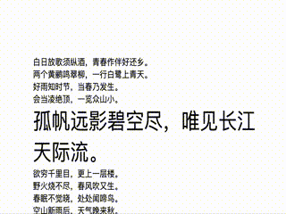

## 神奇魔法棒 —— 超炫导航栏大揭秘

### 一、效果呈现



哇哦，一打开页面，顶部就冒出个超炫的固定栏，就像网页的守护小精灵。它不仅在页面滚动时稳稳站在顶部，还带着超美的点状图案，再加上那恰到好处的饱和度和模糊效果，简直美翻啦，为整个页面增添了超多魅力。

### 二、技术剖析

这种神奇效果主要靠三个超厉害的 CSS 属性来实现哦。

### 1. `background-image: radial-gradient(transparent 1px, #ffffff 2px);`

- 嘿，这个径向渐变就像个神奇的画笔，能在背景上画出超美`渐变`的图案。从透明的 1 像素开始，突然蹦出白色的 2 像素点点，就像变魔法一样，瞬间让固定栏有了独特的点状纹理，超有层次感。😉
- 从技术角度说呢，通过调整渐变的颜色和半径等参数，可以变出各种不同的点状效果。想让点点更明显？那就调亮白色或者改变透明度。想让点点更密集？那就调整渐变半径呗。超好玩的！😎

### 2. `background-size: 4px 4px;`

- 这个属性就像给点状小精灵们选衣服尺码一样。设置成 4px 4px，每个点点就都是这么大啦。想让点点变大点？调大这个值就行。想让点点更细腻？调小就好啦。超灵活有木有！😜

### 3. `backdrop-filter: saturate(50%) blur(4px);`

- 哇塞，这个属性可厉害啦！就像给固定栏施了个超美的`滤镜`魔法。饱和度 50% 让颜色更柔和，模糊效果 4 像素又给固定栏蒙上一层神秘的面纱，超有氛围感。😍
- 不过呢，从技术角度看，这个属性的兼容性有点小麻烦哦。只有一些比较新的浏览器才懂它的美，像 Chrome、Firefox、Safari 和 Edge 的较新版本。旧版本浏览器和一些移动浏览器可能就不买账啦。😏

### 三、兼容性大揭秘

| 属性                                                               | 兼容性情况                                                                                                                                            |
| ------------------------------------------------------------------ | ----------------------------------------------------------------------------------------------------------------------------------------------------- |
| `background-image: radial-gradient(transparent 1px, #ffffff 2px);` | 大多数现代浏览器都很友好，但 Internet Explorer 9 及以下版本这个 “老古董” 就不认识它啦。😒                                                             |
| `background-size: 4px 4px;`                                        | 大部分浏览器都没问题，不过 Internet Explorer 8 及以下版本这个 “小气鬼” 可能不支持哦。😜                                                               |
| `backdrop-filter: saturate(50%) blur(4px);`                        | 只有一些时髦的浏览器才懂它的魅力，像 Chrome、Firefox、Safari 和 Edge 的较新版本。旧浏览器和一些移动浏览器就只能干瞪眼啦。哼，谁让它们不与时俱进呢！😏 |

### 四、代码示例

```html
<!DOCTYPE html>
<html lang="en">
  <head>
    <meta charset="UTF-8" />
    <meta name="viewport" content="width=device-width, initial-scale=1.0" />
    <title>Document</title>
    <style>
      * {
        padding: 0;
        margin: 0;
      }
      .bar {
        position: sticky;
        top: 0;
        width: 100%;
        height: 50px;
        background-image: radial-gradient(transparent 1px, #ffffff 2px);
        background-size: 4px 4px;
        backdrop-filter: saturate(50%) blur(4px);
      }
    </style>
  </head>
  <body>
    <div class="content">
      <p>出师未捷身先死，长使英雄泪满襟。</p>
      <p>人生自古谁无死？留取丹心照汗青。</p>
      <p>粉骨碎身全不怕，要留清白在人间。</p>
      <p>我自横刀向天笑，去留肝胆两昆仑。</p>
      <p>横眉冷对千夫指，俯首甘为孺子牛。</p>
      <p>落霞与孤鹜齐飞，秋水共长天一色。</p>
      <p>问君能有几多愁？恰似一江春水向东流。</p>
    </div>
    <div class="bar"></div>
    <div class="content">
      <p>白日放歌须纵酒，青春作伴好还乡。</p>
      <p>两个黄鹂鸣翠柳，一行白鹭上青天。</p>
      <p>好雨知时节，当春乃发生。</p>
      <p>会当凌绝顶，一览众山小。</p>
      <p>孤帆远影碧空尽，唯见长江天际流。</p>
      <p>欲穷千里目，更上一层楼。</p>
      <p>野火烧不尽，春风吹又生。</p>
      <p>春眠不觉晓，处处闻啼鸟。</p>
      <p>空山新雨后，天气晚来秋。</p>
      <p>明月松间照，清泉石上流。</p>
      <p>竹外桃花三两枝，春江水暖鸭先知。</p>
      <p>日出江花红胜火，春来江水绿如蓝。</p>
      <p>接天莲叶无穷碧，映日荷花别样红。</p>
      <p>小荷才露尖尖角，早有蜻蜓立上头。</p>
      <p>停车坐爱枫林晚，霜叶红于二月花。</p>
      <p>忽如一夜春风来，千树万树梨花开。</p>
      <p>遥知不是雪，为有暗香来。</p>
      <p>飞流直下三千尺，疑是银河落九天。</p>
      <p>独在异乡为异客，每逢佳节倍思亲。</p>
      <p>劝君更尽一杯酒，西出阳关无故人。</p>
      <p>莫愁前路无知己，天下谁人不识君。</p>
      <p>春蚕到死丝方尽，蜡炬成灰泪始干。</p>
      <p>沧海月明珠有泪，蓝田日暖玉生烟。</p>
      <p>身无彩凤双飞翼，心有灵犀一点通。</p>
      <p>天街小雨润如酥，草色遥看近却无。</p>
      <p>洛阳亲友如相问，一片冰心在玉壶。</p>
      <p>黄沙百战穿金甲，不破楼兰终不还。</p>
      <p>两岸猿声啼不住，轻舟已过万重山。</p>
      <p>月出惊山鸟，时鸣春涧中。</p>
      <p>海上生明月，天涯共此时。</p>
      <p>春潮带雨晚来急，野渡无人舟自横。</p>
      <p>大漠孤烟直，长河落日圆。</p>
      <p>东边日出西边雨，道是无晴却有晴。</p>
      <p>曾经沧海难为水，除却巫山不是云。</p>
      <p>露从今夜白，月是故乡明。</p>
      <p>随风潜入夜，润物细无声。</p>
      <p>山重水复疑无路，柳暗花明又一村。</p>
      <p>欲把西湖比西子，淡妆浓抹总相宜。</p>
      <p>千呼万唤始出来，犹抱琵琶半遮面。</p>
      <p>晴空一鹤排云上，便引诗情到碧霄。</p>
      <p>月落乌啼霜满天，江枫渔火对愁眠。</p>
      <p>沉舟侧畔千帆过，病树前头万木春。</p>
    </div>
  </body>
</html>
```

## 五、总结

宝子们，这三个 CSS 属性就像网页设计的魔法棒，能让你的页面瞬间变得超酷超炫。虽然有些老古董浏览器不配合，但咱也不能被它们影响心情呀。大胆地用这些魔法，让你的网页变得独一无二吧！😘😘😘
