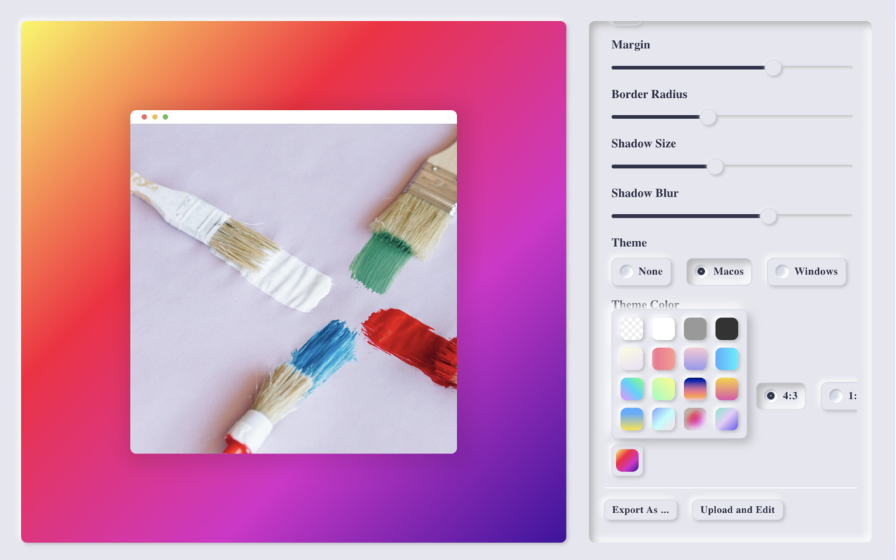
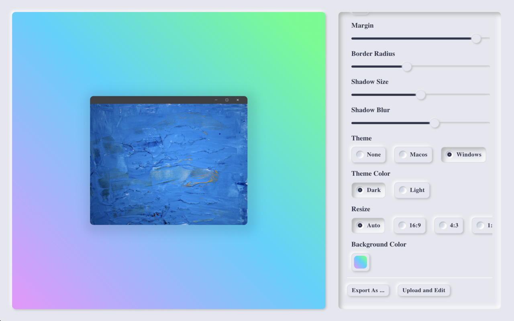
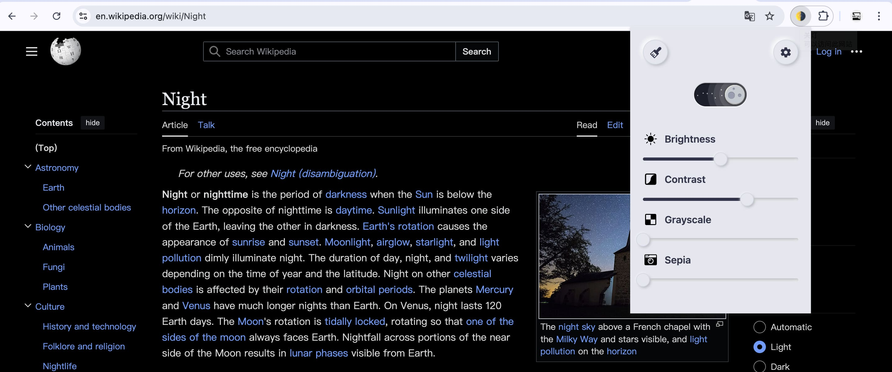
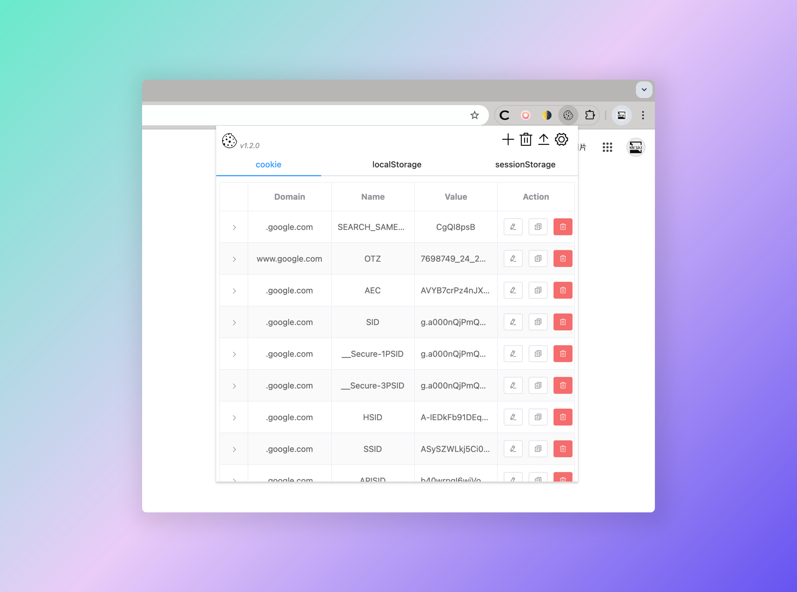
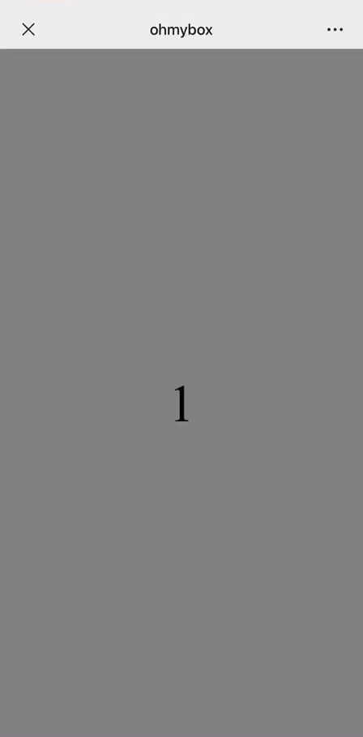

- [Colora](#Colora)
- [关灯](#关灯)
- [OhMyCookie](#OhMyCookie)
- [OhMyBox](#OhMyBox)

## Colora

> Colora 是⼀款基于 Chrome 的扩展程序，它⾮常的轻量级、纯粹并且免费的截图美化⼯具，不滥⽤权限、使⽤最原始、恰到好处的技术实现，并且没有任何⼴告。核⼼逻辑只有不到 5 KB，Chrome 扩展商店搜索「Colora」

⽆需繁琐⽆聊的设计技巧。只需 ⼀次点击，就可以获得精美绝伦、惊⼈震撼的图⽚，让图⽚编辑变得更有趣，那就是 Colora，快来享受它吧！

[在 Chrome 扩展商店查看 「Colora」](https://chromewebstore.google.com/detail/colora-screenshot-and-edi/lajfgofeklkfhemnhomepdojkkljljkp)

## 关灯

> Chrome 扩展程序，暗黑模式一键切换。

「关灯」提供便捷的暗黑模式体验。一键开启后，您的浏览器界面将瞬间切换为深色主题，有效减轻眼部疲劳，同时为您的浏览增添一份神秘与优雅。该扩展兼容性强，适用于绝大多数网站，确保您在享受暗黑模式的同时，不会错过任何重要信息。chrome 扩展商店搜「[关灯](https://chromewebstore.google.com/detail/lights-off%E5%85%B3%E7%81%AF/dnidbhhpcjgffjophhebfelbcnonoclh)」，立即安装，开启您的暗黑模式之旅吧！

---

#### 特性

❇️ 他足够小，核心代码实现只有不到 3KB
❇️ 轻量化，他没有任何依赖，仅使用原生 CSS 实现
❇️ 安全并且谨慎，仅获取读取 TAB 页面信息权限，用于注入样式。不会获取任何其他的权限和信息
❇️ 永久免费，这是一个开源项目，随时可以查看最新的源代码
❇️ 制作他的初衷是我有干眼症并且经常晚上浏览页面，自己需要这样的一个工具，后来发布到 Chrome 商店。希望可以方便到有需要的朋友

[开源仓库地址](https://github.com/slc3a2/dimmer)

[在 Chrome 扩展商店查看 「关灯」](https://chromewebstore.google.com/detail/lights-off%E5%85%B3%E7%81%AF/dnidbhhpcjgffjophhebfelbcnonoclh)

## OhMyCookie

> ⽤来扩展 Chrome 浏览器中 Cookie，Local、SessionStorage 的增删改查、导出操作。Chrome 扩展商店搜 「ohmycookie」

- 基于开源脚⼿架⼯具 vtemp-chrome-extension， 来实现使⽤ Vue 开发
- 可编辑 Cookie 8 种属性，并⽀持以 JSON 导出 本⻚⾯全部 Cookie

[开源仓库地址](https://github.com/slc3a2/oh-my-cookie)

[在 Chrome 扩展商店查看 「OhMyCookie」](https://chromewebstore.google.com/detail/ohmycookie/edkfjjgklckogiepbhmmdlaohebiaigm)

## OhMyBox

> 基于 vue 的移动端滑动组件，类似抖⾳⾸⻚滑屏效果。npm 商店搜「ohmybox」

- 内部单元组件使⽤ Slot 插槽，可⾼度⾃定义内容
- ⽀持 六种参数 和 两种事件 设置：翻⻚⾼度，持续滚动时⻓，快速翻⻚⾼度、模拟点击 ⽅法等

[开源仓库地址](https://github.com/slc3a2/oh-my-box)

[在 npm 商店查看 「OhMyBox」](https://www.npmjs.com/package/ohmybox)
