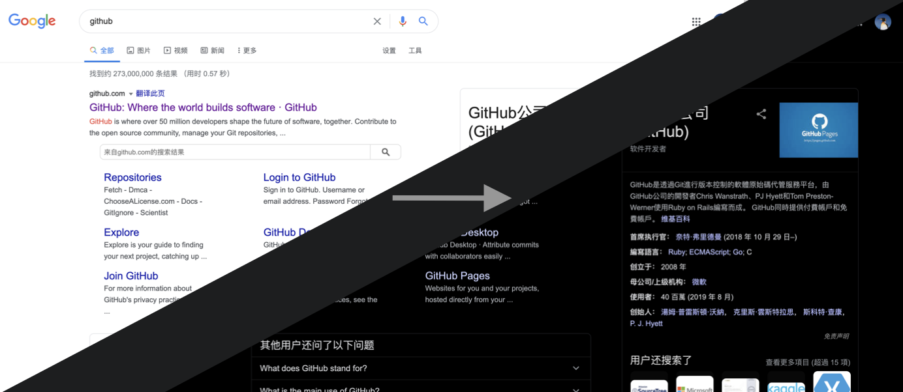
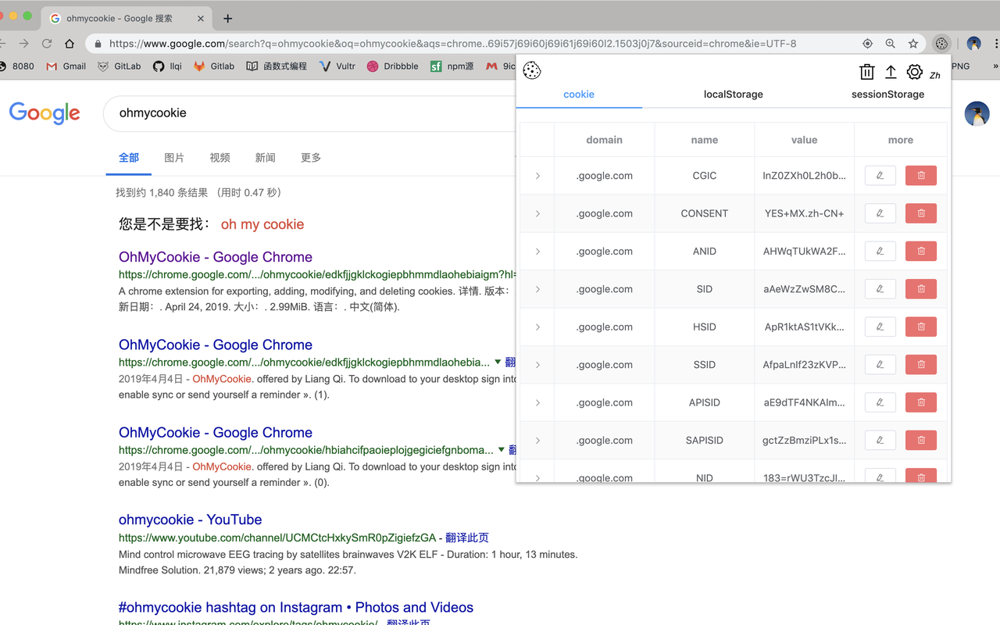

- [Colora](#Colora)
- [关灯](#关灯)
- [OhMyCookie](#OhMyCookie)
- [OhMyBox](#OhMyBox)

## Colora

> Colora 是⼀款基于 Chrome 的扩展程序，它⾮常的轻量级、纯粹并且免费的截图美化⼯具，不滥⽤权限、使⽤最原始、恰到好处的技术实现，并且没有任何⼴告。核⼼逻辑只有不到 5 KB，Chrome 扩展商店搜索「Colora」

⽆需繁琐⽆聊的设计技巧。只需 ⼀次点击，就可以获得精美绝伦、惊⼈震撼的图⽚，让图⽚编辑变得更有趣，那就是 Colora，快来享受它吧！

[在 Chrome 扩展商店查看 「Colora」](https://chromewebstore.google.com/detail/colora-screenshot-and-edi/lajfgofeklkfhemnhomepdojkkljljkp)

## 关灯

> Chrome 扩展程序，暗⿊⽪肤模式⼀键切换。Chrome 扩展商店搜「关灯」

- 迫于晚上爱上⽹，还有⼲眼症。做了简单⼩巧的 Chrome 扩展，可以 ⼀键切换深⾊模式
- 主要使⽤ chrome 扩展 tab 权限和 css3 的 filter 滤镜 属性 invert(1) hue-rotate(180deg)来实现
- 会持续优化，未来功能：根据时间⾃动切换到深⾊⽪肤；打开新⽹⻚窗⼝⾃动使⽤上⼀个⻚⾯的⽪肤模式(已完成)

[开源仓库地址](https://github.com/slc3a2/dimmer)

[在 Chrome 扩展商店查看 「关灯」](https://chromewebstore.google.com/detail/%E5%85%B3%E7%81%AF/dnidbhhpcjgffjophhebfelbcnonoclh)

## OhMyCookie

> ⽤来扩展 Chrome 浏览器中 Cookie，Local、SessionStorage 的增删改查、导出操作。Chrome 扩展商店搜 「ohmycookie」

- 基于开源脚⼿架⼯具 vtemp-chrome-extension， 来实现使⽤ Vue 开发
- 可编辑 Cookie 8 种属性，并⽀持以 JSON 导出 本⻚⾯全部 Cookie

[开源仓库地址](https://github.com/slc3a2/oh-my-cookie)

[在 Chrome 扩展商店查看 「OhMyCookie」](https://chromewebstore.google.com/detail/ohmycookie/edkfjjgklckogiepbhmmdlaohebiaigm)

## OhMyBox

> 基于 vue 的移动端滑动组件，类似抖⾳⾸⻚滑屏效果。npm 商店搜「ohmybox」

- 内部单元组件使⽤ Slot 插槽，可⾼度⾃定义内容
- ⽀持 六种参数 和 两种事件 设置：翻⻚⾼度，持续滚动时⻓，快速翻⻚⾼度、模拟点击 ⽅法等

[开源仓库地址](https://github.com/slc3a2/oh-my-box)

[在 npm 商店查看 「OhMyBox」](https://www.npmjs.com/package/ohmybox)
